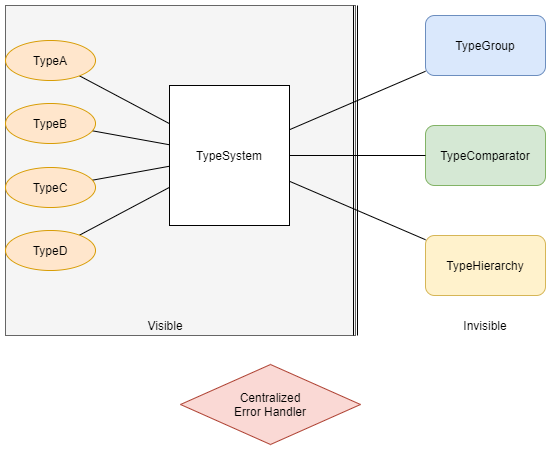
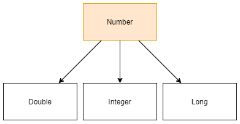
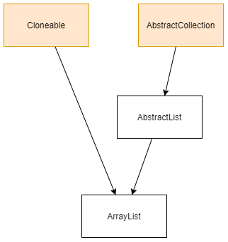
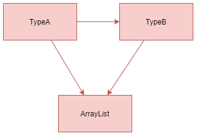
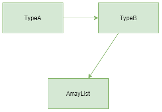

# Type Inference Extension Design Document

Yue Shu
EECS 293
Assignment 10

## Overview

Generally, the project will be supporting two features, type conversion and type inheritance, in addition to the original type inference system. As a result, I will keep the legacy code base we have from programming assignment 2 - 5, and add a few more classes and methods to support the new features we'd like to have.

## Architecture Design

Major changes will be involved in the original TypeSystem and a few more new classes, TypeComparator and TypeHierarchy. As suggested in the diagram below, the users will be interacting with the program purely through interfaces left out in the TypeSystem, unaware of the encapsulated classes TypeGroup, TypeComparator, and TypeHeirarchy. In other words, TypeSystem will invoke the lower level classes and routines in its public routines, and the lower level classes will then perform the type-related tasks correspondingly.

As for error handling, there will be a global error handler to validate all method inputs and handle exceptions whenever necessary. Customized exception class will be addressed in the next assignment when more details on the implementation are available.

### Type Conversion

To support the automatic type unification feature in the scope of type conversion, I will add one more Java class, TypeComparator to the project.

A TypeComparator is used to represent the comparable relationship between Types. For example, in the Number family, an Integer can automatically be converted to a Double because a Double is "wider" than an Integer type. In other words, type conversions can automatically happen when we are converting from "narrower" types to "wider" types. Then in the TypeComparator that contains both Integer and Double, we can tell that Double is wider than Integer.

In my class design, two types can **NEVER** be interconvertible, as certain cases are really rare even in the reality. When a type is comparable with another, there will always be a wider one among them. As a result, the data structure of a TypeComparator can be represented as a serialized list, where types with smaller indices are generally wider.

#### TypeComparator Class Design

A TypeComparator will be a package default class similar to TypeGroup. It will be implementing the Comparator interface with Type as its generic type. Primarily, TypeComparator has a a `private final List<Type> typeComparator`, a `private Type widest` along with its getter, and a `private final TypeSystem typeSytem`.  Its private constructor `private TypeComparator(List<Type> typeComparator, Type widest, TypeSystem typeSytem)` should not throw any exception. Its builder `static final TypeComparator of(Type type, TypeSystem typeSytem)` will invoke the constructor and create a new TypeComparator object. The typeComparator will then be initialized to be a one-element list only containing the given type. The wildest will be the type itself, and typeSytem will be the given type system.

Besides the methods and fields mentioned above, the TypeComparator has a `int size()` and a `public Iterator<Type> iterator()` that are both delecated to its typeComparator. It follows the interface contract of `Comparator<Type>` and thus has a `public int compare(Type o1, Type o2)`. To append two TypeComparators together, it has a `final void appendAfter(TypeComparator other, Type type)`, which will append the entire typeComparator of other after the type in this typeComparator, and set this to be the TypeComparator of all the types in other in typeSystem.

### Type Inheritance

To support the automatic type unification feature in the scope of type inheritance, I will add one more Java class, TypeHierarchy to the project.

A TypeHierarchy is used to represent the hierarichal relationship between Types. For example, we can have Number, Integer, Double, and Long in the numerical type family, and thus they will be put in the same TypeHierarchy. In this example we have one and only one ancestor, which is type Number. The below figure can represent the hierarchical structure of the examle.

Another example could be more complicated, where we can have multiple ancestors, since multiple implementations on the interfaces are allowed in the reality.

In the example above, we will have two independent ancestors in the family tree since an ArrayList can both be an AbstractCollection and share the attributes as a Cloneable. As a result, the data structure to represent a type hierarchy cannot be a tree, although intuitively it does look like one.

In my class design, to represent the actual inheritance attribute of the type hierarchy, I decided to use an acyclic graph with directional edges infering the directed `base` -> `derived` relationship in the inheritance. In actual use case, the structure highlighted in red should not be allowed since a cycle is created. A directional edge should only be used to address immediate inheritence between the base and the derived class. Therefore, we should use the structure highlighted in green instead, which essentially represents the same structure.

  versus 

#### TypeHierarchy Class Design

A TypeHierarchy will be a package default class similar to TypeGroup. Primarily, it has a `private final Map<Type, List<Type>> typeHierarchy`, a `private final Set<Type> ancestor` along with its getter, and a `private final TypeSystem typeSytem`. Its private constructor `private TypeHierarchy(Map<Type, List<Type>> typeHierarchy, Set<Type> ancestor, TypeSystem typeSytem)` should not throw any exception. It has a builder `static final TypeHierarchy of(Type type, TypeSystem typeSytem)` will invoke the constructor and create a new TypeHierarchy object. The typeHierarchy will then be initialized to be a one-key map only containing the given type and the value will be an empty ArrayList. The ancestor will be a one-element set only containing the type as well. The typeSytem will be the given type system.

Besides the methods and fields mentioned above, the TypeHierarchy has a `int size()` that is delecated to its typeHierchy, and a `public Iterator<Map.Entry<Type, List<Type>>> iterator()` that is delecated to the entrySet of its typeHierarchy. The major functionality of TypeHierarchy is achieved through its `final void appendBetween(TypeHierarchy other, Type base, Type derived)`. The method will append the entire type hierarchy of the derived type to the base type, make the typeHierarchy of derived in the typeSystem this typeHierarchy, and additionally add an edge directing from the base to the derived type in the typeHierarchy. Finally, the method will check whether derived was a root of other, and if not, it will add all the ancestors of other to the ancestor of this TypeHierarchy.

Moreover, to support the unification algorithm in our program, TypeHierarchy has a `final Type lowestCommonAncestor(Type t1, Type t2)` that is to search for the lowest common ancestor of two given types in this TypeHierarchy. If such ancestor does not exist, an appropriate state exception will be propogated on an actual throweable cause, to be further addressed in the implementation phase.

### TypeSystem

In addition to the legacy code we have from programming assignment 2 - 5, functionality in TypeSytem will be generally updated as below:

- To maintain the data correlated to TypeComparator and TypeHierarchy, TypeSystem will now have a `private Map<Type, TypeComparator> comparators` and a `private Map<Type, TypeHierarchy> hierarchies`, along with their setters.
- TypeSystem now overloads its original `public final TypeEntry add(TypeEntry typeEntry)` method by allowing additional method signature `Type`. It now has a new `public final Type add(Type type)`, which will create and assign TypeHierarchy and TypeComparator correspondingly for the input type. To adjust SimpleTypeEntry, which can be both a Type and a TypeEntry, the original add method for TypeEntry will invoke the Type version of it when the input typeEntry also qualifies as a Type.
- In addition to the feature supported by the original version of unify method, which only return a boolean indicating the feasibility of unification between variable types and non-variable types, TypeSystem now has a `public final TypeEntry unifyAs(TypeEntry s, TypeEntry t)` that returns an unified version of the given two TypeEntries. See below for the algorithm of unifyAs:
  - check if s and t are in the same typeGroup by checking their representatives, if so, return their representative
  - check if t and s have unifiable component types by recursively checking their underlying types and sub-types
    - this involves checking if they are in the same TypeComparator system or same TypeHierarchy
    - as mentioned above, we prefer type conversion over type inheritance, thus the unified type component will be the wider type among the two if they are comparable, and if not, the LCA of the two if they are in the same hierarchy
  - check if either representative is a variable type, if so, append their groups and return the non-variable one (or either variable if both are variable)
- Additional helper methods will be added if necessary as I proceed to the implementation step.

## Use Case

As suggested in the brand new unification algorithm above, the type inference system prefers type conversion over type inheritance since type conversion can generally infer more information about the relationship between two given Types. As a result, below are some of the example use cases and their results, assuming type inheritance and conversion is strictly followed according to Java language features and API:

- `Integer` and `Double` will be unified as `Double`
- `List<Integer>` and `List<Double>` will be unified as `List<Double>`
- `ArrayList<Double>` and `List<Integer>` will be unified as `List<Double>`
- `ArrayList<Integer>` and `LinkedList<Double>` will be unified as `AbstractList<Double>` (instead of List in the homework example since AbstractList is a lower common ancestor of the given two types)
- `List<T>` and `LinkedList<Integer>` will be unified as `List<Integer>`
- `Integer` and `JFrame` cannot unify since they share no common typeComparator or typeHierarchy (except for Object)
- `ArrayList<Integer>` and `HashMap<Integer, String>` cannot unify

In other words, as long as every corresponding Type in the two given type entries shares either the same type comparator system or the same type hierarchy, then they should unify; otherwise there should be some unification error thrown.

## Error Handling

As suggested in the overview, there will be a global error handler to validate all method inputs and handle exceptions whenever necessary. Customized exception class will be addressed in the next assignment when more details on the implementation are available.

## Testing

In addition to the legacy test suit which achieves almost 100% code and branch coverage, another extensive unit test suite will be added following the test design document we learnt from the previous assignments. Test hook will be used to test any private methods. The test suite will cover code coverage, branch coverage, good and bad data, and some use scenarios as outlined above to test the overall correctness.
